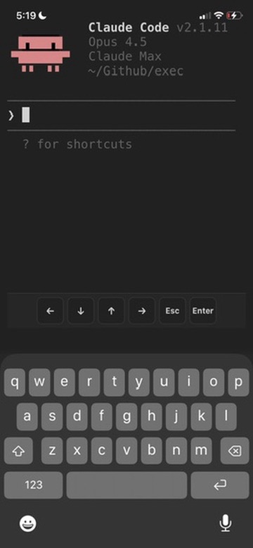

# Claude Anywhere

Your Mac's Claude Code, from your phone or tablet.

Built by [Derek Larson](https://dtlarson.com) for [Delegate with Claude](https://delegatewithclaude.com).


- **Edit files across your Mac** - Notes in your vault, code in other repos, config files. Not limited to Obsidian.
- **Run your custom skills** - `/commit`, `/calendar`, whatever you've built. Your workflow travels with you.
- **Full terminal access** - Git, npm, scripts. Anything Claude Code can do on desktop.
- **Resume on desktop** - Pick up conversations where you left off with `/resume`.

## Compatibility

- Android (phone, tablet)
- iOS (iPhone, iPad)

## Requirements

- Mac with [Claude Code](https://claude.ai/claude-code) installed
- [Tailscale](https://tailscale.com/download) on both devices (same account)
- File sync between Mac and mobile (Obsidian Sync, iCloud, Dropbox, etc.)
- External keyboard recommended

## Setup

### Mac (Server)

#### 1. Install Tailscale

Download from [tailscale.com/download](https://tailscale.com/download), open the app, and sign in.

#### 2. Install the Plugin

Open Terminal, navigate to your Obsidian vault, and run:
```bash
mkdir -p .obsidian/plugins/claude-anywhere && cd .obsidian/plugins/claude-anywhere && curl -LO https://github.com/derek-larson14/obsidian-claude-anywhere/raw/main/main.js && curl -LO https://github.com/derek-larson14/obsidian-claude-anywhere/raw/main/manifest.json && curl -LO https://github.com/derek-larson14/obsidian-claude-anywhere/raw/main/styles.css
```

#### 3. Enable the Plugin

1. Open Obsidian
2. Settings → Community plugins → Enable "Claude Anywhere"
3. Settings → Claude Anywhere → Enable **Remote Access**

#### 4. Keep Your Mac Awake

While using Claude remotely, prevent your Mac from sleeping.

**Option A: Amphetamine (Recommended)**

Install [Amphetamine](https://apps.apple.com/us/app/amphetamine/id937984704?mt=12) from the App Store. It provides a menu bar icon to easily toggle sleep prevention with options for timed sessions, triggers, and more.

**Option B: Terminal**

```bash
caffeinate -dis
```

This prevents sleep even when closing the lid (while plugged in). Close the Terminal window or press `Ctrl+C` to restore normal sleep behavior.

### Mobile Device (Client)

1. Install Tailscale and sign in (same account as Mac)
2. Get the plugin onto your device:
   - **Obsidian Sync** (easiest): Settings → Sync → enable "Installed community plugins", restart Obsidian
   - **Manual**: Download the plugin files (via cloud storage, email, etc.), then use a file manager to move them to your vault's `.obsidian/plugins/claude-anywhere/` folder
3. Enable the plugin: Settings → Community plugins → Enable "Claude Anywhere"
4. Open Claude from the command palette (swipe down): search "Claude"

**Files needed for manual install:** `main.js`, `manifest.json`, `styles.css`

## Usage

### Opening Claude

Use the command palette (swipe down or Cmd+P) and search "Claude":
- "Open Claude Code" - Opens or focuses existing terminal
- "New Claude Tab (Sidebar)" - Opens in right sidebar
- "New Claude Tab (Split View)" - Opens alongside current note
- "New Claude Tab (Full Width)" - Opens as full-screen tab

You can also tap the brain icon in the left ribbon.

### Mobile Controls

On-screen buttons appear at the bottom for keys missing from software keyboards:
- **← ↓ ↑ →** - Arrow keys
- **Esc** - Escape key
- **Enter** - Submit



### Multi-line Input

For multi-line prompts in Claude Code, press **Alt+Enter** or **Shift+Enter** on your external keyboard.

## How It Works

Streams your Mac's Claude Code session to mobile over Tailscale. File sync pushes Claude's edits back to your device.

```
Mobile                          Mac
┌─────────────────┐             ┌─────────────────┐
│ Obsidian        │  Tailscale  │ Obsidian        │
│ + Plugin        │◄───────────►│ + Plugin        │
│ + xterm.js      │   (secure)  │ + relay_server  │
│                 │             │ + Claude Code   │
└─────────────────┘             └─────────────────┘

Connection: ws://100.x.x.x:8765 (Tailscale IP)
```

## Session Behavior

**On disconnect:** Claude session is killed

**To continue a conversation:** Use Claude's `/resume` command after reconnecting.

## Known Limitations

**Scrolling on mobile** - Dragging inside the terminal doesn't scroll well. Use the scrollbar on the right edge, or **Alt+↓** to jump to the bottom.

## Troubleshooting

**"Connection failed"**
- Check Obsidian is open on your Mac
- Check Tailscale is connected on both devices
- Check server is running: Settings → Claude Anywhere on Mac
- Toggle Remote Access off and back on

**Terminal looks garbled**
- Close the terminal tab and open a new one

## Files

- `main.js` - Obsidian plugin code (includes embedded relay server)
- `manifest.json` - Plugin metadata
- `styles.css` - Terminal styling

## Development

The relay server (`relay_server.py`) is embedded as base64 in `main.js` for Obsidian plugin directory compatibility. To rebuild after modifying:

```bash
./build.sh
```

## Contributing

Issues and PRs welcome at [github.com/derek-larson14/obsidian-claude-anywhere](https://github.com/derek-larson14/obsidian-claude-anywhere)

## License

MIT

## Related

- **[Claude Sidebar](https://github.com/derek-larson14/obsidian-claude-sidebar)** - Run Claude Code in your Obsidian sidebar (desktop)
